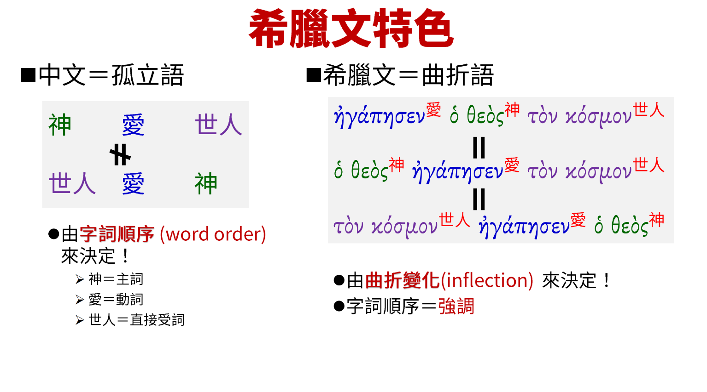
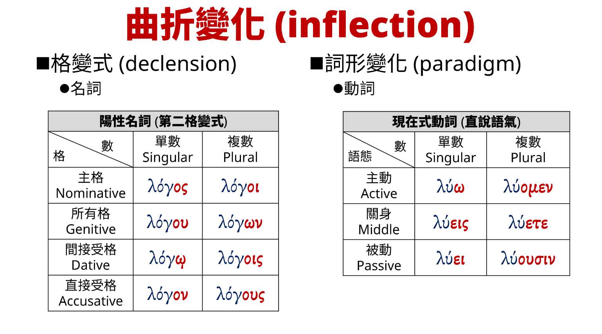

# 立體新標點和合本

　　<strong>立體新標點和合本</strong>（英語：<strong>3D Chinese Union Version with New Punctuation</strong>），簡稱<strong>立體本</strong>（英語：<strong>3D Version</strong>），是我弄的聖經中文譯本，旨在用字型呈現原文意境。我在新標點和合本的文字標上了一些字型變化，偶爾會對文字有些改動，不過絕大多數文字都和新標點和合本一模一樣。

        
　　我希望藉由字型把2D平面的純文字變成3D立體的閱讀體驗。

        
　　這是半成品。截至2023年6月28日，我還在中華福音神學院學習希臘文。未來可能加上更多字型。

        ## 賓語提前粗體字 
        
　　有時我們會把句子中想強調的東西提前。例如，為了強調「瞻馬首」的「馬首」，就變成「馬首是瞻」。希臘文也如此，而且希臘文的文法能把句子中任一個字詞提前。但是中文文法能提前的字詞有限，導致文字上無法翻出原文意境，在立體本中用<b>粗體字</b>呈現被提前的字詞。 

        

          

